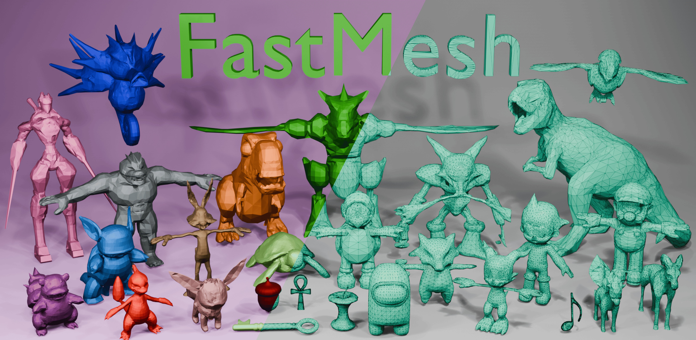

<h1 align="center">FastMesh: Efficient Artistic Mesh Generation via Component Decoupling</h1>


<h4 align="center">

[Jeonghwan Kim](https://jhkim.github.io), [Yushi Lan](https://nirvanalan.github.io), [Armando Fortes](https://atfortes.github.io), [Yongwei Chen](https://cyw-3d.github.io), [Xingang Pan](https://xingangpan.github.io)

S-lab, Nanyang Technological University  

[](https://arxiv.org/abs/2508.19188)
[](https://jhkim0759.github.io/projects/FastMesh)
[](https://huggingface.co/WopperSet/FastMesh-V4K)
[](https://huggingface.co/WopperSet/FastMesh-V1K)

<p align="center">
    
</p>
</h4>

This repository is an official implementation of the paper [FastMesh: Efficient Artistic Mesh Generation via Component Decoupling](https://arxiv.org/pdf/2508.19188). Our approach efficiently produces 3D objects by substantially reducing the number of tokens required for generation. Here is our [Project Page](https://jhkim0759.github.io/projects/FastMesh/).


## 🚧 TODO
- [X] Release Inference Code
- [X] Release Model Weights
- [ ] Release Training Code
- [ ] Release HuggingFace Demo

## ⚙️ Installation
Our environment has been tested on CUDA 11.8 with A6000. (Please report an issue if you find any errors.)

```
conda create -n fastmesh python=3.10
conda activate fastmesh
pip install torch==2.7.1 torchvision==0.22.1 torchaudio==2.7.1 --index-url https://download.pytorch.org/whl/cu118
pip install -r requirements.txt
pip install flash-attn --no-build-isolation
```

## 💡 Quick Start
Generate meshes from sampled point cloud with V1K variant:
```
python inference.py --mesh_path assets --variant V1K --batch_size 3
```
Generate meshes from sampled point cloud with V4K variant:
```
python inference.py --mesh_path assets --variant V4K --batch_size 1
```

## 😊 Acknowledgement
We thank all the authors who made their code public, which tremendously accelerates our project progress.
([MeshAnything](https://github.com/buaacyw/MeshAnything), [MeshAnythingV2](https://github.com/buaacyw/MeshAnythingV2), [BPT](https://github.com/whaohan/bpt), [Michelangelo](https://github.com/NeuralCarver/Michelangelo))


## 📚 Citation
If you find our work helpful, please consider citing:
```bibtex
@misc{kim2025fastmesh,
      title={FastMesh: Efficient Artistic Mesh Generation via Component Decoupling}, 
      author={Jeonghwan Kim and Yushi Lan and Armando Fortes and Yongwei Chen and Xingang Pan},
      year={2025},
      eprint={2508.19188},
      archivePrefix={arXiv},
      url={https://arxiv.org/abs/2508.19188}, 
}
```